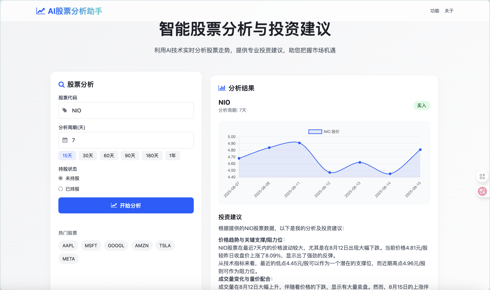

# AI股票分析助手

一个基于AI技术的智能股票分析工具，结合实时股票数据和智谱AI大模型，为用户提供专业的投资分析和建议。

## 🚀 功能特性

- **实时股票数据获取**: 通过yfinance API获取实时股票价格、成交量等数据
- **AI智能分析**: 集成智谱AI大模型，提供专业的股票技术分析和投资建议
- **技术指标计算**: 自动计算MA、MACD、RSI、ATR等常用技术指标
- **持仓管理**: 支持用户输入持仓信息，提供针对性的操作建议
- **可视化图表**: 使用Chart.js展示股票价格走势图
- **响应式设计**: 现代化UI界面，支持移动端和桌面端
- **代理支持**: 内置HTTP/HTTPS代理配置，解决网络访问问题

## 效果演示



*项目界面演示图 - 展示AI股票分析助手的主要功能和用户界面*

## 🛠️ 技术栈

- **后端**: Python Flask
- **AI模型**: 智谱AI GLM-4
- **数据源**: Yahoo Finance (yfinance)
- **数据处理**: Pandas, NumPy
- **前端**: HTML5, Tailwind CSS, Chart.js
- **环境管理**: python-dotenv

## 📋 系统要求

- Python 3.8+
- 网络连接（用于获取股票数据和AI API调用）
- 智谱AI API密钥

## 🔧 安装说明

### 1. 克隆项目

```bash
git https://github.com/Yurh04/AI_Trade.git
cd AI_Trade
```

### 2. 创建虚拟环境

```bash
python -m venv .venv
source .venv/bin/activate  # Linux/Mac
# 或
.venv\Scripts\activate  # Windows
```

### 3. 安装依赖

```bash
pip install -r requirements.txt
```

### 4. 环境配置

创建 `.env` 文件并配置以下环境变量：

```env
# 智谱AI API密钥
ZHIPUAI_API_KEY=your_api_key_here

# 代理设置（需要打开vpn）
HTTPS_PROXY=http://your_proxy:port
HTTP_PROXY=http://your_proxy:port
```

### 5. 运行应用

```bash
python app.py
```

应用将在 `http://localhost:5000` 启动

## 📖 使用方法

### 基础股票分析

1. 在首页输入股票代码（如：AAPL、TSLA、GOOGL等）
2. 选择分析周期（默认30天）
3. 点击"开始分析"按钮
4. 系统将获取股票数据并通过AI进行分析
5. 查看分析结果和价格走势图

### 持仓分析

1. 勾选"我已持有该股票"
2. 输入持仓成本和持股数量
3. 系统将基于当前持仓情况提供针对性建议
4. 包含盈亏计算和仓位管理建议

## 🔍 技术指标说明

- **MA5/MA20**: 5日和20日移动平均线
- **MACD**: 指数平滑移动平均线，用于判断趋势
- **RSI14**: 相对强弱指标，判断超买超卖
- **ATR14**: 平均真实波幅，衡量波动性
- **成交量分析**: 量价配合，判断趋势强度

## 🌐 API接口

### 分析接口

- **URL**: `/analyze`
- **方法**: POST
- **参数**:
  - `symbol`: 股票代码
  - `days`: 分析天数
  - `has_position`: 是否持股
  - `cost_price`: 持仓成本
  - `shares`: 持股数量

### 响应格式

```json
{
  "symbol": "AAPL",
  "analysis": "AI分析结果...",
  "dates": ["2024-01-01", "2024-01-02"],
  "prices": [150.0, 151.0],
  "has_position": false,
  "cost_price": null,
  "shares": null
}
```

## ⚠️ 注意事项

1. **API限制**: Yahoo Finance有访问频率限制，系统内置重试机制
2. **数据准确性**: 股票数据仅供参考，投资决策需谨慎
3. **网络要求**: 需要稳定的网络连接访问外部API
4. **API密钥**: 智谱AI API需要有效的密钥才能使用

## 🐛 故障排除

### 常见问题

1. **无法获取股票数据**
   - 检查网络连接
   - 确认打开VPN代理
   - 查看代理设置

2. **AI分析失败**
   - 验证API密钥有效性
   - 检查网络连接
   - 查看控制台错误信息

3. **代理配置问题**
   - 确认代理服务器状态
   - 检查代理地址和端口
   - 验证代理认证信息

## 📝 开发说明

### 项目结构

```
AI_Trade/
├── app.py              # 主应用文件
├── requirements.txt    # 依赖包列表
├── templates/          # HTML模板
│   ├── index.html     # 主页面
│   └── about.html     # 关于页面
├── test/              # 测试文件
└── .env               # 环境变量配置
```

### 扩展功能

- 添加更多技术指标
- 支持更多股票市场
- 增加历史分析记录
- 实现用户账户系统
- 添加邮件/短信通知

## 📄 许可证

本项目采用 MIT 许可证 - 详见 [LICENSE](LICENSE) 文件

## 🤝 贡献

欢迎提交Issue和Pull Request来改进项目！

## 📞 联系方式

如有问题或建议，请通过以下方式联系：

- 提交GitHub Issue
- 发送邮件至：[yrhrealmadrid@163.com](mailto:yrhrealmadrid@163.com)

---

**免责声明**: 本工具仅用于学习和研究目的，不构成投资建议。投资有风险，入市需谨慎。
